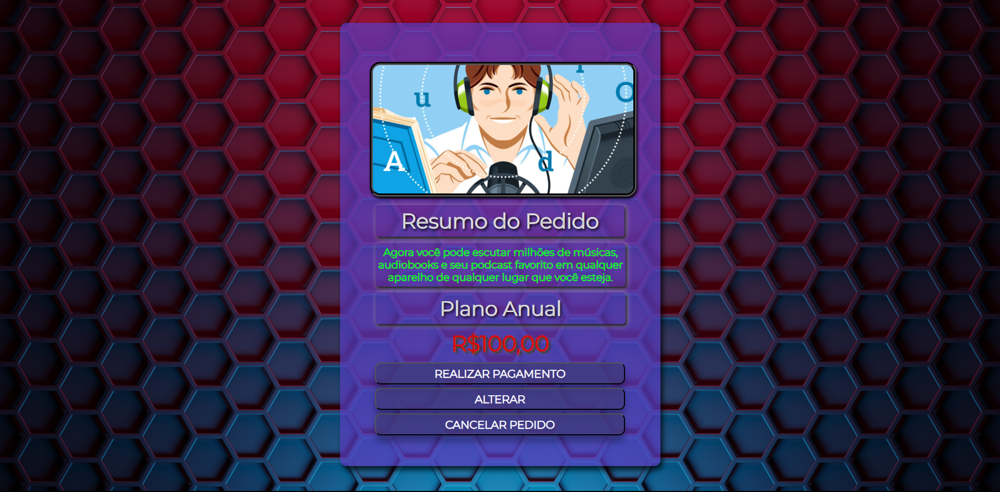

# Projeto CTD - Resumo do Pedido

Deploy: https://resumodopedido.netlify.app

## Sobre

Cartão com o resumo do pedido para adquirir uma assinatura de um serviço de música, audio-books e podcasts.

## Visão geral

Projeto realizado com base no desafio do site Front-end Mentor. Fiz várias modificações do projeto original, adicionando linhas de códigos encontrado na web, os quais alterei para melhor adaptação que entendi ser visualmente mais agradável.

## Desafios e Objetivos

Maior desafio foi centralizar e usar o CSS para que o site ficasse com uma aparência mais limpa. Foram muitos detalhes para serem alterados, mas no final consegui chegar no resultado desejado. Objetivo foi criar uma página web com botões responsivos usando CSS e melhorar a estrutura do HTML. 

## Atualizações

No dia 08 de abril de 2023 fiz uma atualização na interface do projeto, deixando mais moderno e organizei melhor o CSS e o HTML. Depois de ganhar mais experiência senti a necessidade de melhorar meus projetos antigos, fazendo com que fiquem com uma versão melhorada da antiga.

## Ferramentas utilizadas:

- HTML
- CSS